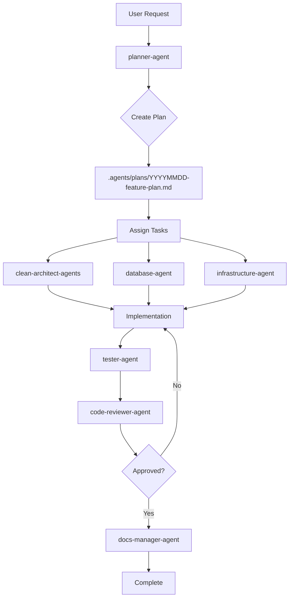

# KinderCare Backend - Development Guide

> This file defines project-specific standards, architectural decisions, and collaboration protocols for AI-assisted development using Claude Code agents.

---

## Table of Contents

1. [Project Overview](#project-overview)
2. [Technology Stack](#technology-stack)
3. [Architectural Decisions](#architectural-decisions)
4. [Domain Model](#domain-model)
5. [Coding Standards](#coding-standards)
6. [Testing Strategy](#testing-strategy)
7. [Agent Collaboration Protocol](#agent-collaboration-protocol)
8. [Context Management](#context-management)
9. [Development Workflow](#development-workflow)
10. [Common Patterns](#common-patterns)
11. [Security Guidelines](#security-guidelines)
12. [Performance Guidelines](#performance-guidelines)

---

## Project Overview

### Project Information

- **Project Name**: KinderCare Backend
- **Version**: 1.0.0
- **Description**: NestJS-based backend system for managing kindergarten/preschool operations including student management, teacher assignments, class management, and parent relationships
- **Author**: [@howznguyen](https://github.com/howznguyen)
- **Repository**: [GitHub](https://github.com/howznguyen/nestjs-clean-architecture-boilerplate)

### Business Context

**KinderCare** is a comprehensive school management system designed for kindergarten and preschool institutions. The system solves:

- **Student Enrollment Management**: Track student information, enrollment status, and class assignments
- **Teacher Management**: Manage teacher profiles, class assignments (homeroom & subject teachers)
- **Parent-Student Relationships**: Support multiple parent types (father, mother, guardian) per student
- **Class Organization**: Organize classes by grade levels with homeroom and subject teacher assignments
- **Role-Based Access Control**: Manage permissions for different user roles (admin, teacher, parent, student)

**Target Users**:
- School administrators
- Teachers (homeroom & subject teachers)
- Parents/guardians
- Students (limited access)

**Key Success Metrics**:
- Efficient student-teacher-parent relationship management
- Accurate class assignment and tracking
- Secure role-based access control
- Fast API response times (<200ms)

### Key Stakeholders

- **Product Owner**: [To be assigned]
- **Tech Lead**: [@howznguyen](https://github.com/howznguyen)
- **DevOps**: [To be assigned]
- **QA Lead**: [To be assigned]

---

## Technology Stack

### Backend

- **Runtime**: Node.js 18+
- **Language**: TypeScript 5.7+
- **Framework**: NestJS 11.0+
- **Database**: PostgreSQL 15+ (with citext extension)
- **ORM**: Prisma 6.0+
- **Cache/Queue**: Redis 7+ (Bull/BullMQ)
- **Authentication**: Clerk (External Auth Provider)
- **Scheduler**: @nestjs/schedule

### Infrastructure

- **Containerization**: Docker + Docker Compose
- **CI/CD**: [GitHub Actions / GitLab CI]
- **Monitoring**: [To be configured]
- **Logging**: NestJS Logger

### Development Tools

- **Package Manager**: npm
- **Linting**: ESLint + Prettier
- **Testing**: Jest
- **API Documentation**: Swagger/OpenAPI
- **Git Hooks**: [To be configured]

---

## Architectural Decisions

### Architecture Pattern

This project follows **Clean Architecture** principles with clear separation of concerns across 4 main layers:

```
src/
├── core/                           # Core utilities and shared modules
│   ├── entities/                   # Base entities and value objects
│   └── modules/
│       └── standard-response/      # Standard response formatting
│
├── domain/                         # Business logic layer (framework-agnostic)
│   └── user-management/            # Domain entities (User, Student, Teacher, etc.)
│
├── application/                    # Use cases layer
│   └── user-management/
│       ├── ports/                  # Repository interfaces
│       └── use-cases/              # Business workflows
│
└── infra/                          # Infrastructure layer
    ├── http/                       # HTTP controllers, DTOs, routes
    │   ├── controllers/
    │   └── dtos/
    ├── persistence/                # Database implementations
    │   └── prisma/
    │       ├── mapper/             # Domain ↔ Persistence mapping
    │       └── repositories/       # Concrete repository implementations
    ├── queue/                      # Background job processing
    │   └── processors/
    └── cronjob/                    # Scheduled tasks
        └── tasks/
```

### Key Design Principles

1. **Separation of Concerns**: Each layer has a single, well-defined responsibility
2. **Dependency Inversion**: Domain layer doesn't depend on infrastructure
3. **Repository Pattern**: Abstract data access through interfaces (ports)
4. **Mapper Pattern**: Clean separation between domain and persistence models
5. **Standard Response Format**: Consistent API responses with filtering, sorting, pagination
6. **SOLID Principles**: Single Responsibility, Open/Closed, Liskov Substitution, Interface Segregation, Dependency Inversion

### Data Flow

```
HTTP Request → Controller → Use Case → Repository Port → Repository Implementation → Prisma → Database
            ← DTO        ← Domain    ← Domain Entity   ← Mapper             ← Model  ←
```

### Layer Dependencies

```
[Presentation/HTTP] → [Application] → [Domain] ← [Infrastructure]
                                         ↑
                                      [Core]
```

**Rules**:
- Domain layer must be **framework-agnostic** (no NestJS decorators)
- Infrastructure depends on domain (via ports)
- Domain never depends on infrastructure
- Application orchestrates use cases
- Presentation handles HTTP concerns only

---

## Domain Model

### Core Entities

#### User
- **Purpose**: Represents any user in the system (admin, teacher, parent, student)
- **Authentication**: Managed by Clerk (`clerkUid`)
- **Roles**: Many-to-many relationship with Role entity
- **Profiles**: Can have TeacherProfile or Student profile (1:1)

#### Student
- **Purpose**: Represents a student enrolled in the school
- **Optional User Link**: Student can exist without login credentials
- **Class Assignment**: Belongs to one class (homeroom)
- **Parents**: Many-to-many with User (parent) via StudentParent

#### TeacherProfile
- **Purpose**: Extended profile for teachers
- **User Link**: One-to-one with User
- **Assignments**: Homeroom teacher and/or subject teacher for multiple classes

#### Class
- **Purpose**: Represents a class/classroom
- **Grade Level**: Belongs to one GradeLevel
- **Teachers**: Homeroom teachers (with roles) and subject teachers
- **Students**: Many students per class

#### Role
- **Purpose**: Permission-based access control
- **Permissions**: JSON field storing permissions
- **Users**: Many-to-many with User

### Relationships

```
User (1:M) → StudentParent (M:1) ← Student
User (1:1) ↔ TeacherProfile
User (M:N) ↔ Role

Student (M:1) → Class (M:1) → GradeLevel
Class (M:N) → ClassHomeroomTeacher (M:1) → TeacherProfile
Class (M:N) → ClassSubjectTeacher (M:1) → TeacherProfile & Subject
```

### Lookup Tables (String-based IDs)

- **ParentRelationship**: "FATHER", "MOTHER", "GUARDIAN"
- **ClassRole**: "HOMEROOM_TEACHER", "ASSISTANT"

---

## Coding Standards

### TypeScript Guidelines

```typescript
// ✅ Good: Explicit types, clear naming
interface UserRepository {
  findById(id: number): Promise<User | null>;
  findByEmail(email: string): Promise<User | null>;
  save(user: User): Promise<User>;
  delete(id: number): Promise<void>;
}

export class UserService implements UserRepository {
  async findById(id: number): Promise<User | null> {
    // Implementation
  }
}

// ❌ Bad: Implicit any, unclear naming
async function getData(x) {
  return await db.query(x);
}
```

### NestJS Conventions

```typescript
// ✅ Good: Proper dependency injection
@Injectable()
export class CreateUserUseCase {
  constructor(
    @Inject('USER_REPOSITORY')
    private readonly userRepository: UserRepository,
  ) {}

  async execute(dto: CreateUserDto): Promise<User> {
    // Use case logic
  }
}

// ✅ Good: Controller with standard response
@Controller('users')
@ApiTags('Users')
export class UserController {
  constructor(private readonly createUserUseCase: CreateUserUseCase) {}

  @Post()
  @StandardResponse({
    message: 'User created successfully',
    type: UserResponseDto,
  })
  async create(@Body() dto: CreateUserDto) {
    return await this.createUserUseCase.execute(dto);
  }
}
```

### Naming Conventions

- **Files**: `kebab-case.ts` (e.g., `create-user.use-case.ts`)
- **Classes**: `PascalCase` (e.g., `CreateUserUseCase`)
- **Interfaces/Ports**: `PascalCase` (e.g., `UserRepository`)
- **Functions/Methods**: `camelCase` (e.g., `findUserById`)
- **Constants**: `SCREAMING_SNAKE_CASE` (e.g., `MAX_STUDENTS_PER_CLASS`)
- **DTOs**: `PascalCase` with suffix (e.g., `CreateUserDto`, `UserResponseDto`)
- **Entities**: `PascalCase` (e.g., `User`, `Student`, `Class`)

### Error Handling

```typescript
// ✅ Good: Custom domain exceptions
export class UserNotFoundException extends Error {
  constructor(userId: number) {
    super(`User with ID ${userId} not found`);
    this.name = 'UserNotFoundException';
  }
}

export class EmailAlreadyExistsException extends ConflictException {
  constructor(email: string) {
    super(`User with email ${email} already exists`);
  }
}

// ✅ Good: Comprehensive error handling in use cases
async execute(id: number): Promise<User> {
  try {
    const user = await this.userRepository.findById(id);
    if (!user) {
      throw new UserNotFoundException(id);
    }
    return user;
  } catch (error) {
    this.logger.error('Failed to fetch user', { userId: id, error });
    throw error;
  }
}
```

### Mapper Pattern

```typescript
// ✅ Good: Mapper between domain and persistence
export class PrismaUserMapper {
  static toDomain(prismaUser: PrismaUser): User {
    return {
      id: prismaUser.id,
      email: prismaUser.email,
      fullName: prismaUser.fullName,
      phoneNumber: prismaUser.phoneNumber,
      isActive: prismaUser.isActive,
      createdAt: prismaUser.createdAt,
      updatedAt: prismaUser.updatedAt,
    };
  }

  static toPrisma(domainUser: User): Prisma.UserCreateInput {
    return {
      email: domainUser.email,
      fullName: domainUser.fullName,
      phoneNumber: domainUser.phoneNumber,
      isActive: domainUser.isActive,
    };
  }
}
```

### Code Comments

```typescript
// ✅ Good: Explain WHY, not WHAT
// We use Clerk for authentication because it provides enterprise-grade
// security, MFA support, and reduces our security maintenance burden
const clerkUid = user.clerkUid;

// ✅ Good: Document business rules
// Students can have multiple parents (father, mother, guardian)
// Each relationship is tracked separately for emergency contacts
const parents = await this.getStudentParents(studentId);

// ❌ Bad: Stating the obvious
// Get user by ID
const user = await this.userRepository.findById(id);
```

---

## Testing Strategy

### Test Coverage Requirements

- **Unit Tests**: 80%+ coverage for business logic (domain, application layers)
- **Integration Tests**: All API endpoints with database operations
- **E2E Tests**: Critical user journeys (authentication, student enrollment, class assignments)

### Test Structure

```typescript
describe('CreateUserUseCase', () => {
  let useCase: CreateUserUseCase;
  let mockRepository: jest.Mocked<UserRepository>;

  beforeEach(() => {
    mockRepository = {
      findByEmail: jest.fn(),
      save: jest.fn(),
    } as any;
    useCase = new CreateUserUseCase(mockRepository);
  });

  describe('execute', () => {
    it('should create a new user with valid data', async () => {
      // Arrange
      const dto = { email: 'test@example.com', fullName: 'Test User' };
      mockRepository.findByEmail.mockResolvedValue(null);
      mockRepository.save.mockResolvedValue({ id: 1, ...dto });

      // Act
      const result = await useCase.execute(dto);

      // Assert
      expect(result).toBeDefined();
      expect(result.email).toBe(dto.email);
      expect(mockRepository.save).toHaveBeenCalledWith(expect.objectContaining(dto));
    });

    it('should throw error when email already exists', async () => {
      // Arrange
      const dto = { email: 'existing@example.com', fullName: 'Test' };
      mockRepository.findByEmail.mockResolvedValue({ id: 1, email: dto.email } as any);

      // Act & Assert
      await expect(useCase.execute(dto)).rejects.toThrow(EmailAlreadyExistsException);
    });
  });
});
```

### Testing Best Practices

- Use **Arrange-Act-Assert (AAA)** pattern
- Mock external dependencies (database, Clerk, Redis)
- Test edge cases and error scenarios
- Keep tests fast (<100ms for unit tests)
- Use descriptive test names that explain behavior
- Test domain logic independently of infrastructure

---

## Agent Collaboration Protocol

### Overview

This project uses multiple AI agents that collaborate to deliver features. Each agent has specific expertise and responsibilities, ensuring high-quality code delivery following Clean Architecture principles.

### Available Agents

| Agent                      | Responsibility                            | When to Use                                                  |
| -------------------------- | ----------------------------------------- | ------------------------------------------------------------ |
| **planner-agent**          | Research, planning, architecture design   | Starting new features, refactoring, technical spikes         |
| **clean-architect-agents** | Implement Clean Architecture patterns     | Building domain entities, use cases, repositories, mappers   |
| **database-agent**         | Database design, optimization, migrations | Prisma schema changes, query optimization, data migration    |
| **code-reviewer-agent**    | Code quality assessment, security audit   | After implementation, before PR merge                        |
| **tester-agent**           | Test implementation and validation        | Writing unit/integration tests, validating coverage          |
| **debugger-agent**         | Issue investigation, performance analysis | Bugs, performance issues, error diagnosis                    |
| **infrastructure-agent**   | DevOps, CI/CD, deployment                 | Docker config, Redis setup, queue configuration, deployment  |
| **docs-manager-agent**     | Documentation management                  | Writing/updating docs, API documentation, ADRs               |

### Collaboration Workflow



### Collaboration Rules

1. **Planning First**: Complex features start with planner-agent creating a detailed plan
2. **Context Sharing**: All agents read from `.agents/` directory for shared context
3. **Plan Reference**: Agents reference the plan file: `.agents/plans/YYYYMMDD-feature-name-plan.md`
4. **Sequential Execution**: Implementation → Testing → Review → Documentation
5. **Context Preservation**: Each agent saves its work context to `.agents/[agent-name]/`
6. **Clean Architecture Compliance**: All implementations must follow layer separation rules

### Agent Communication

Agents communicate through:

1. **Plan Documents** (`.agents/plans/`): Primary source of truth for feature implementation
2. **Shared Knowledge** (`.agents/shared-knowledge/`): Architecture decisions, patterns, standards
3. **Session Logs** (`.agents/sessions/`): Collaboration history and decisions
4. **Project Context** (`.agents/project-context.md`): Overall project information

### Example Collaboration Flow

```markdown
## Feature: Implement Student Enrollment with Parent Assignment

### Phase 1: Planning (planner-agent)
- Research student enrollment best practices
- Analyze existing domain models (Student, User, StudentParent)
- Create implementation plan: `.agents/plans/20251031-student-enrollment-plan.md`
- Assign tasks:
  - clean-architect-agents: domain entities, use cases
  - database-agent: Prisma schema validation
  - infrastructure-agent: queue setup for enrollment notifications

### Phase 2: Implementation (clean-architect-agents)
- **Domain Layer**:
  - Update Student entity with enrollment methods
  - Create EnrollmentRequest value object
  - Saves context to: `.agents/clean-architect-agents/20251031-student-enrollment-domain.md`

- **Application Layer**:
  - Create EnrollStudentUseCase
  - Create AssignParentsUseCase
  - Implement validation logic
  - Saves context to: `.agents/clean-architect-agents/20251031-student-enrollment-application.md`

- **Infrastructure Layer**:
  - Implement PrismaStudentRepository
  - Create StudentMapper
  - Add StudentParentMapper
  - Saves context to: `.agents/clean-architect-agents/20251031-student-enrollment-infrastructure.md`

- **Presentation Layer**:
  - Create StudentController
  - Create EnrollStudentDto, AssignParentsDto
  - Setup Swagger documentation
  - Saves context to: `.agents/clean-architect-agents/20251031-student-enrollment-presentation.md`

### Phase 3: Database Validation (database-agent)
- Validates Prisma schema relationships
- Checks indexes on frequently queried columns (classId, userId)
- Verifies cascade delete behaviors
- Saves context to: `.agents/database-agent/20251031-student-enrollment-schema.md`

### Phase 4: Infrastructure Setup (infrastructure-agent)
- Configure Bull queue for enrollment notifications
- Setup email processor for parent notifications
- Saves context to: `.agents/infrastructure-agent/20251031-enrollment-queue.md`

### Phase 5: Testing (tester-agent)
- Unit tests for EnrollStudentUseCase
- Unit tests for AssignParentsUseCase
- Integration tests for StudentController
- E2E test for complete enrollment flow
- Validates 80%+ coverage
- Saves context to: `.agents/tester-agent/20251031-student-enrollment-tests.md`

### Phase 6: Review (code-reviewer-agent)
- Checks Clean Architecture compliance
- Validates mapper usage
- Checks security (authorization)
- Reviews error handling
- Validates standard response format
- Generates review report: `.agents/code-reviewer-agent/reviews/20251031-student-enrollment-review.md`

### Phase 7: Documentation (docs-manager-agent)
- Updates API documentation
- Creates ADR for enrollment workflow
- Updates this CLAUDE.md if new patterns introduced
- Saves context to: `.agents/docs-manager-agent/20251031-student-enrollment-docs.md`
```

---

## Context Management

### Directory Structure

```
project-root/
├── .agents/                          # Context management root
│   ├── project-context.md            # Project overview and metadata
│   │
│   ├── plans/                        # Feature implementation plans
│   │   ├── 20251031-student-enrollment-plan.md
│   │   ├── 20251031-teacher-assignment-plan.md
│   │   └── README.md
│   │
│   ├── shared-knowledge/             # Cross-cutting knowledge base
│   │   ├── architecture-decisions.md # ADRs (Architecture Decision Records)
│   │   ├── coding-standards.md       # Project-specific coding rules
│   │   ├── domain-model.md           # Domain model documentation
│   │   ├── error-patterns.md         # Common error handling patterns
│   │   ├── mapper-patterns.md        # Mapper pattern examples
│   │   ├── security-checklist.md     # Security requirements
│   │   └── README.md
│   │
│   ├── sessions/                     # Collaboration session logs
│   │   ├── 20251031-session-1.md
│   │   └── README.md
│   │
│   ├── planner-agent/                # Planner agent context
│   │   ├── research-notes/
│   │   └── README.md
│   │
│   ├── clean-architect-agents/       # Architecture implementation context
│   │   ├── implementations/
│   │   └── README.md
│   │
│   ├── database-agent/               # Database agent context
│   │   ├── migrations/
│   │   ├── optimizations/
│   │   └── README.md
│   │
│   ├── code-reviewer-agent/          # Code review reports
│   │   ├── reviews/
│   │   └── README.md
│   │
│   ├── tester-agent/                 # Testing context
│   │   ├── test-plans/
│   │   └── README.md
│   │
│   ├── debugger-agent/               # Debugging sessions
│   │   ├── investigations/
│   │   └── README.md
│   │
│   ├── infrastructure-agent/         # Infrastructure context
│   │   ├── deployments/
│   │   └── README.md
│   │
│   └── docs-manager-agent/           # Documentation context
│       ├── updates/
│       └── README.md
```

### Context File Naming Convention

```
Format: YYYYMMDD-[feature-name]-[context-type].md

Examples:
- 20251031-student-enrollment-plan.md
- 20251031-student-enrollment-domain.md
- 20251031-student-enrollment-application.md
- 20251031-student-enrollment-infrastructure.md
- 20251031-student-enrollment-presentation.md
- 20251031-student-enrollment-review.md
- 20251031-student-enrollment-tests.md
```

### Context Metadata

Every context file should include frontmatter:

```markdown
---
title: Student Enrollment Implementation
created: 2025-10-31
agent: clean-architect-agents
status: completed
related-plan: 20251031-student-enrollment-plan.md
layer: application
dependencies:
  - domain: Student entity, EnrollmentRequest value object
  - infrastructure: PrismaStudentRepository, StudentMapper
  - database-agent: Prisma schema validation
tags: [student, enrollment, parent-assignment, use-case]
---

[Content here]
```

### Context Usage Guidelines

1. **Read Before Write**: Always check `.agents/project-context.md` and related plans before starting work
2. **Reference Plans**: Link to the original plan document in all implementation context files
3. **Update Shared Knowledge**: If you discover new patterns or decisions, update `.agents/shared-knowledge/`
4. **Log Collaboration**: Document significant agent interactions in `.agents/sessions/`
5. **Clean Up**: Archive completed session contexts after feature is merged
6. **Layer-Specific Context**: Tag context files with the layer they affect (domain, application, infrastructure, presentation)

---

## Development Workflow

### 1. Feature Development

```bash
# 1. Create feature branch
git checkout -b feature/student-enrollment

# 2. Agent creates plan
# planner-agent generates: .agents/plans/20251031-student-enrollment-plan.md

# 3. Implementation by specialized agents
# clean-architect-agents implements domain → application → infrastructure → presentation

# 4. Generate Prisma client if schema changed
npm run prisma:generate

# 5. Run database migrations if needed
npm run prisma:migrate:dev

# 6. Run tests
npm run test

# 7. Start dev server and test manually
npm run start:dev

# 8. Code review
# code-reviewer-agent analyzes changes

# 9. Create PR
gh pr create --title "Add student enrollment feature" --body "See plan: .agents/plans/20251031-student-enrollment-plan.md"
```

### 2. Bug Fixing

```bash
# 1. Create bug fix branch
git checkout -b fix/student-parent-duplicate

# 2. Investigation
# debugger-agent investigates and logs to: .agents/debugger-agent/investigations/20251031-student-parent-duplicate.md

# 3. Fix implementation
# Relevant agent implements fix in appropriate layer

# 4. Add regression test
# tester-agent creates test case

# 5. Verify fix
npm run test

# 6. Create PR with investigation reference
```

### 3. Database Migrations

```bash
# 1. Schema changes planned
# database-agent creates migration plan

# 2. Update Prisma schema
# Edit prisma/schema.prisma

# 3. Create migration
npm run prisma:migrate:dev --name add_student_enrollment_date

# 4. Test migration
npm run prisma:migrate:deploy

# 5. Verify in Prisma Studio
npm run prisma:studio

# 6. Save migration context
# database-agent logs to: .agents/database-agent/migrations/20251031-add-enrollment-date.md
```

### 4. Deployment

```bash
# 1. Build and test
npm run build
npm run test

# 2. Infrastructure preparation
# infrastructure-agent prepares deployment context

# 3. Deploy with Docker
docker-compose up --build app

# 4. Run migrations in production
docker-compose exec app npm run prisma:migrate:deploy

# 5. Monitor
# Check logs, health endpoints
```

---

## Common Patterns

### Repository Pattern

```typescript
// application/user-management/ports/user.repository.ts
export interface UserRepository {
  findById(id: number): Promise<User | null>;
  findByEmail(email: string): Promise<User | null>;
  findByClerkUid(clerkUid: string): Promise<User | null>;
  save(user: User): Promise<User>;
  update(id: number, data: Partial<User>): Promise<User>;
  delete(id: number): Promise<void>;
}

// infra/persistence/prisma/repositories/prisma-user.repository.ts
@Injectable()
export class PrismaUserRepository implements UserRepository {
  constructor(private prisma: PrismaService) {}

  async findById(id: number): Promise<User | null> {
    const prismaUser = await this.prisma.user.findUnique({
      where: { id },
      include: { roles: true },
    });
    return prismaUser ? PrismaUserMapper.toDomain(prismaUser) : null;
  }

  async save(user: User): Promise<User> {
    const prismaData = PrismaUserMapper.toPrisma(user);
    const created = await this.prisma.user.create({ data: prismaData });
    return PrismaUserMapper.toDomain(created);
  }
}
```

### Use Case Pattern

```typescript
// application/user-management/use-cases/enroll-student.use-case.ts
@Injectable()
export class EnrollStudentUseCase {
  constructor(
    @Inject('STUDENT_REPOSITORY')
    private readonly studentRepository: StudentRepository,
    @Inject('CLASS_REPOSITORY')
    private readonly classRepository: ClassRepository,
  ) {}

  async execute(dto: EnrollStudentDto): Promise<Student> {
    // 1. Validation
    const classEntity = await this.classRepository.findById(dto.classId);
    if (!classEntity) {
      throw new ClassNotFoundException(dto.classId);
    }

    // 2. Business rules
    const studentsCount = await this.studentRepository.countByClassId(dto.classId);
    if (studentsCount >= classEntity.maxCapacity) {
      throw new ClassFullException(dto.classId);
    }

    // 3. Create entity
    const student = Student.create({
      fullName: dto.fullName,
      dateOfBirth: dto.dateOfBirth,
      classId: dto.classId,
    });

    // 4. Persist
    const saved = await this.studentRepository.save(student);

    // 5. Return domain entity
    return saved;
  }
}
```

### Mapper Pattern

```typescript
// infra/persistence/prisma/mapper/prisma-student.mapper.ts
export class PrismaStudentMapper {
  static toDomain(prismaStudent: PrismaStudent & { class?: PrismaClass }): Student {
    return {
      id: prismaStudent.id,
      fullName: prismaStudent.fullName,
      dateOfBirth: prismaStudent.dateOfBirth,
      address: prismaStudent.address,
      classId: prismaStudent.classId,
      userId: prismaStudent.userId,
      class: prismaStudent.class ? PrismaClassMapper.toDomain(prismaStudent.class) : undefined,
      createdAt: prismaStudent.createdAt,
      updatedAt: prismaStudent.updatedAt,
    };
  }

  static toPrisma(student: Student): Prisma.StudentCreateInput {
    return {
      fullName: student.fullName,
      dateOfBirth: student.dateOfBirth,
      address: student.address,
      class: student.classId ? { connect: { id: student.classId } } : undefined,
      user: student.userId ? { connect: { id: student.userId } } : undefined,
    };
  }

  static toUpdate(student: Partial<Student>): Prisma.StudentUpdateInput {
    const data: Prisma.StudentUpdateInput = {};
    if (student.fullName !== undefined) data.fullName = student.fullName;
    if (student.dateOfBirth !== undefined) data.dateOfBirth = student.dateOfBirth;
    if (student.address !== undefined) data.address = student.address;
    if (student.classId !== undefined) {
      data.class = { connect: { id: student.classId } };
    }
    return data;
  }
}
```

### Standard Response Format

```typescript
// infra/http/controllers/student.controller.ts
@Controller('students')
@ApiTags('Students')
export class StudentController {
  constructor(private readonly enrollStudentUseCase: EnrollStudentUseCase) {}

  @Post()
  @StandardResponse({
    message: 'Student enrolled successfully',
    type: StudentResponseDto,
  })
  @ApiOperation({ summary: 'Enroll a new student' })
  async enroll(@Body() dto: EnrollStudentDto) {
    return await this.enrollStudentUseCase.execute(dto);
  }

  @Get()
  @StandardResponse({
    message: 'Students retrieved successfully',
    type: StudentResponseDto,
    isArray: true,
  })
  @ApiOperation({ summary: 'Get all students with filtering, sorting, pagination' })
  async findAll(@Query() query: StandardRequestDto) {
    // StandardRequestDto provides filtering, sorting, pagination
    return await this.getAllStudentsUseCase.execute(query);
  }
}
```

### Queue Processing

```typescript
// infra/queue/processors/enrollment-notification.processor.ts
@Processor('enrollment')
export class EnrollmentNotificationProcessor {
  constructor(private readonly emailService: EmailService) {}

  @Process('send-parent-notification')
  async handleParentNotification(job: Job<EnrollmentNotificationDto>) {
    const { studentName, parentEmail, className } = job.data;

    await this.emailService.send({
      to: parentEmail,
      subject: 'Student Enrollment Confirmation',
      template: 'enrollment-confirmation',
      context: { studentName, className },
    });
  }
}

// Usage in use case
await this.queueService.addJob('enrollment', 'send-parent-notification', {
  studentName: student.fullName,
  parentEmail: parent.email,
  className: classEntity.name,
});
```

---

## Security Guidelines

### Authentication & Authorization

- **Authentication**: Managed by Clerk (external provider)
- **User Identification**: `clerkUid` field in User table
- **Authorization**: Role-based permissions stored in Role entity
- **Guards**: Implement NestJS guards for protected routes

```typescript
// infra/http/guards/roles.guard.ts
@Injectable()
export class RolesGuard implements CanActivate {
  constructor(private reflector: Reflector) {}

  canActivate(context: ExecutionContext): boolean {
    const requiredRoles = this.reflector.getAllAndOverride<string[]>('roles', [
      context.getHandler(),
      context.getClass(),
    ]);

    if (!requiredRoles) {
      return true;
    }

    const { user } = context.switchToHttp().getRequest();
    return requiredRoles.some((role) => user.roles?.includes(role));
  }
}

// Usage
@UseGuards(RolesGuard)
@Roles('ADMIN', 'TEACHER')
@Get('students')
async getStudents() {
  // Only accessible by ADMIN or TEACHER
}
```

### Input Validation

```typescript
import { IsString, IsEmail, IsOptional, IsInt, Min, Max } from 'class-validator';
import { ApiProperty } from '@nestjs/swagger';

export class EnrollStudentDto {
  @ApiProperty({ example: 'Nguyễn Văn A' })
  @IsString()
  fullName: string;

  @ApiProperty({ example: '2018-05-15' })
  @IsOptional()
  dateOfBirth?: Date;

  @ApiProperty({ example: 1 })
  @IsInt()
  @Min(1)
  classId: number;

  @ApiProperty({ example: '123 Đường ABC, Quận 1, TP.HCM' })
  @IsOptional()
  @IsString()
  address?: string;
}
```

### Sensitive Data

- Never commit secrets, API keys, credentials
- Use environment variables (`.env` file, never committed)
- Redact sensitive data in logs
- Use Clerk for authentication (no password storage)

```typescript
// ✅ Good: Environment variables
const databaseUrl = process.env.DATABASE_URL;
const clerkSecretKey = process.env.CLERK_SECRET_KEY;

// ❌ Bad: Hardcoded secrets
const apiKey = 'sk-1234567890abcdef';
```

---

## Performance Guidelines

### Database Optimization

- **Indexes**: Already defined on frequently queried columns
  - `User.email`, `User.phoneNumber`, `User.clerkUid` (unique indexes)
  - `Student.classId`, `StudentParent.parentUserId` (composite indexes)
- **Pagination**: Use `StandardRequestDto` for cursor-based pagination
- **Eager Loading**: Use Prisma `include` to avoid N+1 queries
- **Connection Pooling**: Prisma handles connection pooling automatically

```typescript
// ✅ Good: Eager loading to avoid N+1
const students = await this.prisma.student.findMany({
  include: {
    class: true,
    parents: {
      include: {
        parent: true,
        parentRelationship: true,
      },
    },
  },
});

// ❌ Bad: N+1 query problem
const students = await this.prisma.student.findMany();
for (const student of students) {
  const parents = await this.prisma.studentParent.findMany({
    where: { studentId: student.id },
  }); // N additional queries!
}
```

### API Performance

```typescript
// ✅ Good: Efficient query with pagination
async findAll(query: StandardRequestDto): Promise<PaginatedResponse<Student>> {
  const { page, limit, sort, filter } = query;

  const students = await this.prisma.student.findMany({
    skip: (page - 1) * limit,
    take: limit,
    where: filter,
    orderBy: sort,
    select: {
      id: true,
      fullName: true,
      classId: true,
      // Only select needed fields
    },
  });

  return {
    data: students,
    pagination: { page, limit, total },
  };
}
```

### Caching Strategy

```typescript
// Use Redis for caching expensive queries
@Injectable()
export class StudentService {
  constructor(
    private redis: Redis,
    private studentRepository: StudentRepository,
  ) {}

  async findById(id: number): Promise<Student | null> {
    const cacheKey = `student:${id}`;

    // Check cache first
    const cached = await this.redis.get(cacheKey);
    if (cached) {
      return JSON.parse(cached);
    }

    // Fetch from database
    const student = await this.studentRepository.findById(id);

    // Cache for 5 minutes
    if (student) {
      await this.redis.set(cacheKey, JSON.stringify(student), 'EX', 300);
    }

    return student;
  }
}
```

---

## Monitoring & Observability

### Logging

```typescript
import { Logger } from '@nestjs/common';

@Injectable()
export class EnrollStudentUseCase {
  private readonly logger = new Logger(EnrollStudentUseCase.name);

  async execute(dto: EnrollStudentDto): Promise<Student> {
    this.logger.log(`Enrolling student: ${dto.fullName} to class ${dto.classId}`);

    try {
      const student = await this.studentRepository.save(dto);
      this.logger.log(`Student enrolled successfully: ID ${student.id}`);
      return student;
    } catch (error) {
      this.logger.error(`Failed to enroll student: ${error.message}`, error.stack);
      throw error;
    }
  }
}
```

### Metrics to Track

- API response times (p50, p95, p99)
- Error rates by endpoint
- Database query performance
- Queue processing times
- Active user sessions
- Student enrollment rate

---

## Troubleshooting

### Common Issues

1. **Prisma client out of sync**
   ```bash
   npm run prisma:generate
   ```

2. **Database migration errors**
   ```bash
   # Reset database (development only!)
   npm run prisma:migrate:reset

   # Or apply pending migrations
   npm run prisma:migrate:deploy
   ```

3. **Redis connection errors**
   - Check Redis container is running: `docker-compose ps`
   - Verify `REDIS_HOST` and `REDIS_PORT` in `.env`

4. **Clerk authentication issues**
   - Verify `CLERK_SECRET_KEY` in `.env`
   - Check Clerk dashboard for API key status

---

## Resources

### Internal Documentation

- [API Documentation](http://localhost:3000/api/docs) (Swagger)
- [Database Schema](./prisma/schema.prisma)
- [Architecture Decisions](./.agents/shared-knowledge/architecture-decisions.md)
- [Domain Model](./.agents/shared-knowledge/domain-model.md)

### External Resources

- [NestJS Documentation](https://docs.nestjs.com/)
- [Prisma Documentation](https://www.prisma.io/docs/)
- [Clean Architecture](https://blog.cleancoder.com/uncle-bob/2012/08/13/the-clean-architecture.html)
- [TypeScript Handbook](https://www.typescriptlang.org/docs/)
- [Clerk Documentation](https://clerk.com/docs)

---

## Development Rules

### Code Quality Guidelines

- Don't be too harsh on code linting
- Prioritize functionality and readability over strict style enforcement
- Use reasonable code quality standards that enhance developer productivity
- **Always use try-catch error handling** in use cases and controllers
- Validate inputs at the presentation layer (DTOs with class-validator)
- Keep domain logic in domain layer, not in controllers

### Pre-commit/Push Rules

- Run linting before commit: `npm run lint`
- Run tests before push: `npm run test` (DO NOT ignore failed tests)
- Keep commits focused on actual code changes
- **DO NOT commit confidential information** (.env files, API keys, credentials)
- **NEVER automatically add AI attribution signatures**:
  - ❌ "🤖 Generated with [Claude Code]"
  - ❌ "Co-Authored-By: Claude noreply@anthropic.com"
  - ❌ Any AI tool attribution or signature
- Create clean, professional commit messages without AI references
- Use conventional commit format:
  - `feat: add student enrollment feature`
  - `fix: resolve duplicate parent assignment`
  - `refactor: improve mapper pattern`
  - `docs: update API documentation`
  - `test: add unit tests for EnrollStudentUseCase`

---

## Changelog

### Version 1.0.0 - 2025-10-31

- Initial CLAUDE.md for KinderCare Backend
- Defined Clean Architecture structure
- Documented domain model (User, Student, Teacher, Class, Role)
- Established agent collaboration protocol
- Added coding standards and testing guidelines
- Defined mapper pattern usage
- Added security and performance guidelines

---

**Last Updated**: 2025-10-31
**Maintained By**: [@howznguyen](https://github.com/howznguyen)
**Review Frequency**: Monthly or when significant architectural changes occur

<!-- BACKLOG.MD GUIDELINES START -->
# Instructions for the usage of Backlog.md CLI Tool

## Backlog.md: Comprehensive Project Management Tool via CLI

### Assistant Objective

Efficiently manage all project tasks, status, and documentation using the Backlog.md CLI, ensuring all project metadata
remains fully synchronized and up-to-date.

### Core Capabilities

- ✅ **Task Management**: Create, edit, assign, prioritize, and track tasks with full metadata
- ✅ **Search**: Fuzzy search across tasks, documents, and decisions with `backlog search`
- ✅ **Acceptance Criteria**: Granular control with add/remove/check/uncheck by index
- ✅ **Board Visualization**: Terminal-based Kanban board (`backlog board`) and web UI (`backlog browser`)
- ✅ **Git Integration**: Automatic tracking of task states across branches
- ✅ **Dependencies**: Task relationships and subtask hierarchies
- ✅ **Documentation & Decisions**: Structured docs and architectural decision records
- ✅ **Export & Reporting**: Generate markdown reports and board snapshots
- ✅ **AI-Optimized**: `--plain` flag provides clean text output for AI processing

### Why This Matters to You (AI Agent)

1. **Comprehensive system** - Full project management capabilities through CLI
2. **The CLI is the interface** - All operations go through `backlog` commands
3. **Unified interaction model** - You can use CLI for both reading (`backlog task 1 --plain`) and writing (
   `backlog task edit 1`)
4. **Metadata stays synchronized** - The CLI handles all the complex relationships

### Key Understanding

- **Tasks** live in `backlog/tasks/` as `task-<id> - <title>.md` files
- **You interact via CLI only**: `backlog task create`, `backlog task edit`, etc.
- **Use `--plain` flag** for AI-friendly output when viewing/listing
- **Never bypass the CLI** - It handles Git, metadata, file naming, and relationships

---

# ⚠️ CRITICAL: NEVER EDIT TASK FILES DIRECTLY. Edit Only via CLI

**ALL task operations MUST use the Backlog.md CLI commands**

- ✅ **DO**: Use `backlog task edit` and other CLI commands
- ✅ **DO**: Use `backlog task create` to create new tasks
- ✅ **DO**: Use `backlog task edit <id> --check-ac <index>` to mark acceptance criteria
- ❌ **DON'T**: Edit markdown files directly
- ❌ **DON'T**: Manually change checkboxes in files
- ❌ **DON'T**: Add or modify text in task files without using CLI

**Why?** Direct file editing breaks metadata synchronization, Git tracking, and task relationships.

---

## 1. Source of Truth & File Structure

### 📖 **UNDERSTANDING** (What you'll see when reading)

- Markdown task files live under **`backlog/tasks/`** (drafts under **`backlog/drafts/`**)
- Files are named: `task-<id> - <title>.md` (e.g., `task-42 - Add GraphQL resolver.md`)
- Project documentation is in **`backlog/docs/`**
- Project decisions are in **`backlog/decisions/`**

### 🔧 **ACTING** (How to change things)

- **All task operations MUST use the Backlog.md CLI tool**
- This ensures metadata is correctly updated and the project stays in sync
- **Always use `--plain` flag** when listing or viewing tasks for AI-friendly text output

---

## 2. Common Mistakes to Avoid

### ❌ **WRONG: Direct File Editing**

```markdown
# DON'T DO THIS:

1. Open backlog/tasks/task-7 - Feature.md in editor
2. Change "- [ ]" to "- [x]" manually
3. Add notes directly to the file
4. Save the file
```

### ✅ **CORRECT: Using CLI Commands**

```bash
# DO THIS INSTEAD:
backlog task edit 7 --check-ac 1  # Mark AC #1 as complete
backlog task edit 7 --notes "Implementation complete"  # Add notes
backlog task edit 7 -s "In Progress" -a @agent-k  # Multiple commands: change status and assign the task when you start working on the task
```

---

## 3. Understanding Task Format (Read-Only Reference)

⚠️ **FORMAT REFERENCE ONLY** - The following sections show what you'll SEE in task files.
**Never edit these directly! Use CLI commands to make changes.**

### Task Structure You'll See

```markdown
---
id: task-42
title: Add GraphQL resolver
status: To Do
assignee: [@sara]
labels: [backend, api]
---

## Description

Brief explanation of the task purpose.

## Acceptance Criteria

<!-- AC:BEGIN -->

- [ ] #1 First criterion
- [x] #2 Second criterion (completed)
- [ ] #3 Third criterion

<!-- AC:END -->

## Implementation Plan

1. Research approach
2. Implement solution

## Implementation Notes

Summary of what was done.
```

### How to Modify Each Section

| What You Want to Change | CLI Command to Use                                       |
|-------------------------|----------------------------------------------------------|
| Title                   | `backlog task edit 42 -t "New Title"`                    |
| Status                  | `backlog task edit 42 -s "In Progress"`                  |
| Assignee                | `backlog task edit 42 -a @sara`                          |
| Labels                  | `backlog task edit 42 -l backend,api`                    |
| Description             | `backlog task edit 42 -d "New description"`              |
| Add AC                  | `backlog task edit 42 --ac "New criterion"`              |
| Check AC #1             | `backlog task edit 42 --check-ac 1`                      |
| Uncheck AC #2           | `backlog task edit 42 --uncheck-ac 2`                    |
| Remove AC #3            | `backlog task edit 42 --remove-ac 3`                     |
| Add Plan                | `backlog task edit 42 --plan "1. Step one\n2. Step two"` |
| Add Notes (replace)     | `backlog task edit 42 --notes "What I did"`              |
| Append Notes            | `backlog task edit 42 --append-notes "Another note"` |

---

## 4. Defining Tasks

### Creating New Tasks

**Always use CLI to create tasks:**

```bash
# Example
backlog task create "Task title" -d "Description" --ac "First criterion" --ac "Second criterion"
```

### Title (one liner)

Use a clear brief title that summarizes the task.

### Description (The "why")

Provide a concise summary of the task purpose and its goal. Explains the context without implementation details.

### Acceptance Criteria (The "what")

**Understanding the Format:**

- Acceptance criteria appear as numbered checkboxes in the markdown files
- Format: `- [ ] #1 Criterion text` (unchecked) or `- [x] #1 Criterion text` (checked)

**Managing Acceptance Criteria via CLI:**

⚠️ **IMPORTANT: How AC Commands Work**

- **Adding criteria (`--ac`)** accepts multiple flags: `--ac "First" --ac "Second"` ✅
- **Checking/unchecking/removing** accept multiple flags too: `--check-ac 1 --check-ac 2` ✅
- **Mixed operations** work in a single command: `--check-ac 1 --uncheck-ac 2 --remove-ac 3` ✅

```bash
# Examples

# Add new criteria (MULTIPLE values allowed)
backlog task edit 42 --ac "User can login" --ac "Session persists"

# Check specific criteria by index (MULTIPLE values supported)
backlog task edit 42 --check-ac 1 --check-ac 2 --check-ac 3  # Check multiple ACs
# Or check them individually if you prefer:
backlog task edit 42 --check-ac 1    # Mark #1 as complete
backlog task edit 42 --check-ac 2    # Mark #2 as complete

# Mixed operations in single command
backlog task edit 42 --check-ac 1 --uncheck-ac 2 --remove-ac 3

# ❌ STILL WRONG - These formats don't work:
# backlog task edit 42 --check-ac 1,2,3  # No comma-separated values
# backlog task edit 42 --check-ac 1-3    # No ranges
# backlog task edit 42 --check 1         # Wrong flag name

# Multiple operations of same type
backlog task edit 42 --uncheck-ac 1 --uncheck-ac 2  # Uncheck multiple ACs
backlog task edit 42 --remove-ac 2 --remove-ac 4    # Remove multiple ACs (processed high-to-low)
```

**Key Principles for Good ACs:**

- **Outcome-Oriented:** Focus on the result, not the method.
- **Testable/Verifiable:** Each criterion should be objectively testable
- **Clear and Concise:** Unambiguous language
- **Complete:** Collectively cover the task scope
- **User-Focused:** Frame from end-user or system behavior perspective

Good Examples:

- "User can successfully log in with valid credentials"
- "System processes 1000 requests per second without errors"
- "CLI preserves literal newlines in description/plan/notes; `\\n` sequences are not auto‑converted"

Bad Example (Implementation Step):

- "Add a new function handleLogin() in auth.ts"
- "Define expected behavior and document supported input patterns"

### Task Breakdown Strategy

1. Identify foundational components first
2. Create tasks in dependency order (foundations before features)
3. Ensure each task delivers value independently
4. Avoid creating tasks that block each other

### Task Requirements

- Tasks must be **atomic** and **testable** or **verifiable**
- Each task should represent a single unit of work for one PR
- **Never** reference future tasks (only tasks with id < current task id)
- Ensure tasks are **independent** and don't depend on future work

---

## 5. Implementing Tasks

### 5.1. First step when implementing a task

The very first things you must do when you take over a task are:

* set the task in progress
* assign it to yourself

```bash
# Example
backlog task edit 42 -s "In Progress" -a @{myself}
```

### 5.2. Create an Implementation Plan (The "how")

Previously created tasks contain the why and the what. Once you are familiar with that part you should think about a
plan on **HOW** to tackle the task and all its acceptance criteria. This is your **Implementation Plan**.
First do a quick check to see if all the tools that you are planning to use are available in the environment you are
working in.   
When you are ready, write it down in the task so that you can refer to it later.

```bash
# Example
backlog task edit 42 --plan "1. Research codebase for references\n2Research on internet for similar cases\n3. Implement\n4. Test"
```

## 5.3. Implementation

Once you have a plan, you can start implementing the task. This is where you write code, run tests, and make sure
everything works as expected. Follow the acceptance criteria one by one and MARK THEM AS COMPLETE as soon as you
finish them.

### 5.4 Implementation Notes (PR description)

When you are done implementing a tasks you need to prepare a PR description for it.
Because you cannot create PRs directly, write the PR as a clean description in the task notes.
Append notes progressively during implementation using `--append-notes`:

```
backlog task edit 42 --append-notes "Implemented X" --append-notes "Added tests"
```

```bash
# Example
backlog task edit 42 --notes "Implemented using pattern X because Reason Y, modified files Z and W"
```

**IMPORTANT**: Do NOT include an Implementation Plan when creating a task. The plan is added only after you start the
implementation.

- Creation phase: provide Title, Description, Acceptance Criteria, and optionally labels/priority/assignee.
- When you begin work, switch to edit, set the task in progress and assign to yourself
  `backlog task edit <id> -s "In Progress" -a "..."`.
- Think about how you would solve the task and add the plan: `backlog task edit <id> --plan "..."`.
- After updating the plan, share it with the user and ask for confirmation. Do not begin coding until the user approves the plan or explicitly tells you to skip the review.
- Add Implementation Notes only after completing the work: `backlog task edit <id> --notes "..."` (replace) or append progressively using `--append-notes`.

## Phase discipline: What goes where

- Creation: Title, Description, Acceptance Criteria, labels/priority/assignee.
- Implementation: Implementation Plan (after moving to In Progress and assigning to yourself).
- Wrap-up: Implementation Notes (Like a PR description), AC and Definition of Done checks.

**IMPORTANT**: Only implement what's in the Acceptance Criteria. If you need to do more, either:

1. Update the AC first: `backlog task edit 42 --ac "New requirement"`
2. Or create a new follow up task: `backlog task create "Additional feature"`

---

## 6. Typical Workflow

```bash
# 1. Identify work
backlog task list -s "To Do" --plain

# 2. Read task details
backlog task 42 --plain

# 3. Start work: assign yourself & change status
backlog task edit 42 -s "In Progress" -a @myself

# 4. Add implementation plan
backlog task edit 42 --plan "1. Analyze\n2. Refactor\n3. Test"

# 5. Share the plan with the user and wait for approval (do not write code yet)

# 6. Work on the task (write code, test, etc.)

# 7. Mark acceptance criteria as complete (supports multiple in one command)
backlog task edit 42 --check-ac 1 --check-ac 2 --check-ac 3  # Check all at once
# Or check them individually if preferred:
# backlog task edit 42 --check-ac 1
# backlog task edit 42 --check-ac 2
# backlog task edit 42 --check-ac 3

# 8. Add implementation notes (PR Description)
backlog task edit 42 --notes "Refactored using strategy pattern, updated tests"

# 9. Mark task as done
backlog task edit 42 -s Done
```

---

## 7. Definition of Done (DoD)

A task is **Done** only when **ALL** of the following are complete:

### ✅ Via CLI Commands:

1. **All acceptance criteria checked**: Use `backlog task edit <id> --check-ac <index>` for each
2. **Implementation notes added**: Use `backlog task edit <id> --notes "..."`
3. **Status set to Done**: Use `backlog task edit <id> -s Done`

### ✅ Via Code/Testing:

4. **Tests pass**: Run test suite and linting
5. **Documentation updated**: Update relevant docs if needed
6. **Code reviewed**: Self-review your changes
7. **No regressions**: Performance, security checks pass

⚠️ **NEVER mark a task as Done without completing ALL items above**

---

## 8. Finding Tasks and Content with Search

When users ask you to find tasks related to a topic, use the `backlog search` command with `--plain` flag:

```bash
# Search for tasks about authentication
backlog search "auth" --plain

# Search only in tasks (not docs/decisions)
backlog search "login" --type task --plain

# Search with filters
backlog search "api" --status "In Progress" --plain
backlog search "bug" --priority high --plain
```

**Key points:**
- Uses fuzzy matching - finds "authentication" when searching "auth"
- Searches task titles, descriptions, and content
- Also searches documents and decisions unless filtered with `--type task`
- Always use `--plain` flag for AI-readable output

---

## 9. Quick Reference: DO vs DON'T

### Viewing and Finding Tasks

| Task         | ✅ DO                        | ❌ DON'T                         |
|--------------|-----------------------------|---------------------------------|
| View task    | `backlog task 42 --plain`   | Open and read .md file directly |
| List tasks   | `backlog task list --plain` | Browse backlog/tasks folder     |
| Check status | `backlog task 42 --plain`   | Look at file content            |
| Find by topic| `backlog search "auth" --plain` | Manually grep through files |

### Modifying Tasks

| Task          | ✅ DO                                 | ❌ DON'T                           |
|---------------|--------------------------------------|-----------------------------------|
| Check AC      | `backlog task edit 42 --check-ac 1`  | Change `- [ ]` to `- [x]` in file |
| Add notes     | `backlog task edit 42 --notes "..."` | Type notes into .md file          |
| Change status | `backlog task edit 42 -s Done`       | Edit status in frontmatter        |
| Add AC        | `backlog task edit 42 --ac "New"`    | Add `- [ ] New` to file           |

---

## 10. Complete CLI Command Reference

### Task Creation

| Action           | Command                                                                             |
|------------------|-------------------------------------------------------------------------------------|
| Create task      | `backlog task create "Title"`                                                       |
| With description | `backlog task create "Title" -d "Description"`                                      |
| With AC          | `backlog task create "Title" --ac "Criterion 1" --ac "Criterion 2"`                 |
| With all options | `backlog task create "Title" -d "Desc" -a @sara -s "To Do" -l auth --priority high` |
| Create draft     | `backlog task create "Title" --draft`                                               |
| Create subtask   | `backlog task create "Title" -p 42`                                                 |

### Task Modification

| Action           | Command                                     |
|------------------|---------------------------------------------|
| Edit title       | `backlog task edit 42 -t "New Title"`       |
| Edit description | `backlog task edit 42 -d "New description"` |
| Change status    | `backlog task edit 42 -s "In Progress"`     |
| Assign           | `backlog task edit 42 -a @sara`             |
| Add labels       | `backlog task edit 42 -l backend,api`       |
| Set priority     | `backlog task edit 42 --priority high`      |

### Acceptance Criteria Management

| Action              | Command                                                                     |
|---------------------|-----------------------------------------------------------------------------|
| Add AC              | `backlog task edit 42 --ac "New criterion" --ac "Another"`                  |
| Remove AC #2        | `backlog task edit 42 --remove-ac 2`                                        |
| Remove multiple ACs | `backlog task edit 42 --remove-ac 2 --remove-ac 4`                          |
| Check AC #1         | `backlog task edit 42 --check-ac 1`                                         |
| Check multiple ACs  | `backlog task edit 42 --check-ac 1 --check-ac 3`                            |
| Uncheck AC #3       | `backlog task edit 42 --uncheck-ac 3`                                       |
| Mixed operations    | `backlog task edit 42 --check-ac 1 --uncheck-ac 2 --remove-ac 3 --ac "New"` |

### Task Content

| Action           | Command                                                  |
|------------------|----------------------------------------------------------|
| Add plan         | `backlog task edit 42 --plan "1. Step one\n2. Step two"` |
| Add notes        | `backlog task edit 42 --notes "Implementation details"`  |
| Add dependencies | `backlog task edit 42 --dep task-1 --dep task-2`         |

### Multi‑line Input (Description/Plan/Notes)

The CLI preserves input literally. Shells do not convert `\n` inside normal quotes. Use one of the following to insert real newlines:

- Bash/Zsh (ANSI‑C quoting):
  - Description: `backlog task edit 42 --desc $'Line1\nLine2\n\nFinal'`
  - Plan: `backlog task edit 42 --plan $'1. A\n2. B'`
  - Notes: `backlog task edit 42 --notes $'Done A\nDoing B'`
  - Append notes: `backlog task edit 42 --append-notes $'Progress update line 1\nLine 2'`
- POSIX portable (printf):
  - `backlog task edit 42 --notes "$(printf 'Line1\nLine2')"`
- PowerShell (backtick n):
  - `backlog task edit 42 --notes "Line1`nLine2"`

Do not expect `"...\n..."` to become a newline. That passes the literal backslash + n to the CLI by design.

Descriptions support literal newlines; shell examples may show escaped `\\n`, but enter a single `\n` to create a newline.

### Implementation Notes Formatting

- Keep implementation notes human-friendly and PR-ready: use short paragraphs or
  bullet lists instead of a single long line.
- Lead with the outcome, then add supporting details (e.g., testing, follow-up
  actions) on separate lines or bullets.
- Prefer Markdown bullets (`-` for unordered, `1.` for ordered) so Maintainers
  can paste notes straight into GitHub without additional formatting.
- When using CLI flags like `--append-notes`, remember to include explicit
  newlines. Example:

  ```bash
  backlog task edit 42 --append-notes $'- Added new API endpoint\n- Updated tests\n- TODO: monitor staging deploy'
  ```

### Task Operations

| Action             | Command                                      |
|--------------------|----------------------------------------------|
| View task          | `backlog task 42 --plain`                    |
| List tasks         | `backlog task list --plain`                  |
| Search tasks       | `backlog search "topic" --plain`              |
| Search with filter | `backlog search "api" --status "To Do" --plain` |
| Filter by status   | `backlog task list -s "In Progress" --plain` |
| Filter by assignee | `backlog task list -a @sara --plain`         |
| Archive task       | `backlog task archive 42`                    |
| Demote to draft    | `backlog task demote 42`                     |

---

## Common Issues

| Problem              | Solution                                                           |
|----------------------|--------------------------------------------------------------------|
| Task not found       | Check task ID with `backlog task list --plain`                     |
| AC won't check       | Use correct index: `backlog task 42 --plain` to see AC numbers     |
| Changes not saving   | Ensure you're using CLI, not editing files                         |
| Metadata out of sync | Re-edit via CLI to fix: `backlog task edit 42 -s <current-status>` |

---

## Remember: The Golden Rule

**🎯 If you want to change ANYTHING in a task, use the `backlog task edit` command.**
**📖 Use CLI to read tasks, exceptionally READ task files directly, never WRITE to them.**

Full help available: `backlog --help`

<!-- BACKLOG.MD GUIDELINES END -->
